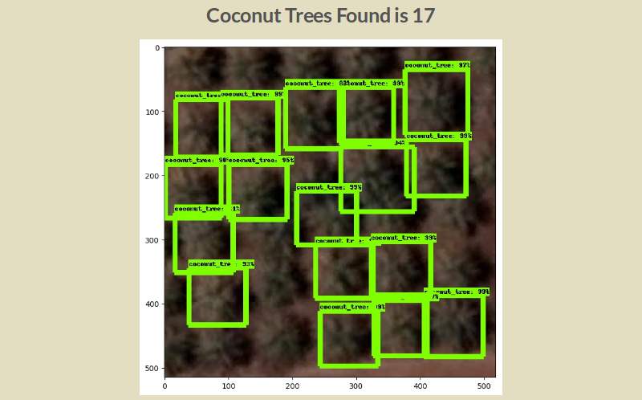

# COCONUT WEB

provide a web interface to trained model to count and localize coconut trees from google satellite imagery.

## Setup

Download

- [tensorflw/models](https://github.com/tensorflow/models/tree/master/research).
- [Frozen Graph of Coconut Tree](https://www.dropbox.com/s/zftxbo4dvaaua8e/frozen_inference_graph.pb?dl=0)

And Follow [installation instructions](https://github.com/tensorflow/models/blob/master/research/object_detection/g3doc/installation.md)

And install flask using  `pip install -r requirements.txt`

## Configuration

`cp setting.py.example settings.py`

modify settings.py accordingly.

## Run

`python app.py runserver`

## Sample Output

## Reference

- [Train Tensorflow Object Detection on own dataset](https://stackoverflow.com/questions/44973184/train-tensorflow-object-detection-on-own-dataset/44973203#44973203)
- [How to train your own Object Detector with TensorFlow’s Object Detector API](https://medium.com/towards-data-science/how-to-train-your-own-object-detector-with-tensorflows-object-detector-api-bec72ecfe1d9)
- [Tensorflow detection model zoo](https://github.com/tensorflow/models/blob/master/research/object_detection/g3doc/detection_model_zoo.md)

## Team Members

- [Hijas Ajmal](https://github.com/HijasAjmal)
- [Shabeer Salman](https://github.com/shabeersalman)
- [Mohammed Afal](https://github.com/afalmuhammad)
- [Mohamed Rashid](https://github.com/rashivkp)
